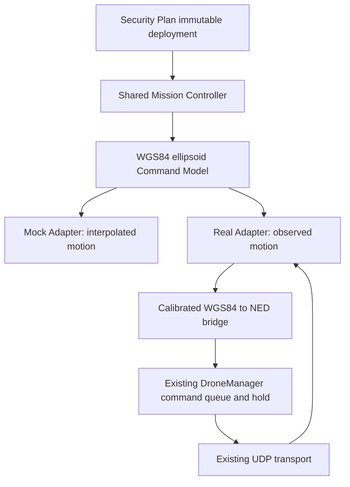

# P5.4 shared mission controller and execution adapters

SecurityPlanStore owns the single persisted mission lifecycle for both modes: deployment snapshot, per-aircraft trajectory, schedule, waypoint index, hover timer, group state, progress and conflict checks. `security_mission::Command` carries UAV/execution identity, a WGS84 ellipsoid target and speed. The historical `mock_execution.inl` filename is retained; it now hosts this shared controller rather than a separate Real task implementation.

The adapters own no mission state, schedule or waypoint loop. Mock integrates a position for the supplied step. Real sends a changed target once and advances only on measured arrival; command acceptance is not arrival. Both return a position, consumed time and arrival indication to the same controller. Hover timing and completion remain shared. Real positions are never snapped to nominal waypoints and UE does not replace live telemetry with simulated execution poses.

## Default and activation boundary

All existing launcher fixtures still select Mock. No real aircraft was connected or commanded during this task. The Real tests use injected observation/transport callbacks; the HTTP gate test uses an empty fleet and empty UDP port map.

Real mode is an explicit Backend-host configuration: place `real_execution.json` beside the selected storage `drones.json`, with `enabled: true`, configured UAVs and calibrated frame data. `Backend/config-examples/real_execution.example.json` is disabled by default and is not loaded by the application under that filename. An enabled Real configuration and `mock_execution.json` together are rejected. There is no UI switch that silently changes a stored simulation into real control; execution mode is persisted and a mode mismatch fails without dispatch.

Each fleet member needs its registered numeric `drone_id`, matching `UAV-<slot>` identity, optional radius, and `frame_anchor`: latitude/longitude, altitude and explicit Ellipsoid or MSL reference (MSL additionally requires geoid undulation), plus the NED n/e/d measured at that calibration point. The first GPS sample is not assumed to be PX4 local zero. The current DroneManager GPS anchor must match the configured reference within 5 cm; anchor changes require recalibration. Conversion uses WGS84 ECEF/local NED and is limited to nonpolar 10 km missions.

Position observations require ONLINE plus estimator-valid local telemetry received within three seconds. Move dispatch additionally requires Armed and Offboard; starting a Security Plan does not arm or take off. An unavailable observation or rejected command fails the group and requests measured-position holds for already executing/paused members. A rejected hold is reported as `REAL_HOLD_REJECTED`, never as confirmed stopping. Physical stopping and separation cannot be guaranteed solely by this software check.

## Restart, shutdown and control ownership

A restored non-scheduled Real execution is durably PAUSED and requires explicit resume. Scheduled deadlines remain scheduled. Graceful mission shutdown preserves scheduled records and holds active Real work; Mock shutdown cannot control a Real host. Real state is kept durable if WebSocket publication fails, so snapshot hydration recovers committed intent rather than pretending already issued hardware commands were rolled back.

When Real mode is enabled, legacy assembly/move/debug telemetry and registry update/delete paths are rejected; they cannot compete with the mission controller. Read-only status remains available. The previous legacy engine and wire interfaces are preserved for default-mode compatibility, not used as a second Real Security Plan task engine. The only change inside DroneManager is an additive read-only fresh-telemetry accessor reusing its existing safe-hold freshness predicate.

## Evidence boundaries

Unit coverage includes measured arrival/hover, hold/resume, command/hold rejection, restart, mode isolation, publication failure, group failure, swept observed crossings, nonzero NED calibration, height round trips and domain rejection. The empty-fleet HTTP test verifies Real hydration and control-owner gates without transport. This is software architecture/contract evidence, not airworthiness, actuator response, takeoff, radio reliability, actual geoid accuracy or hardware acceptance.
