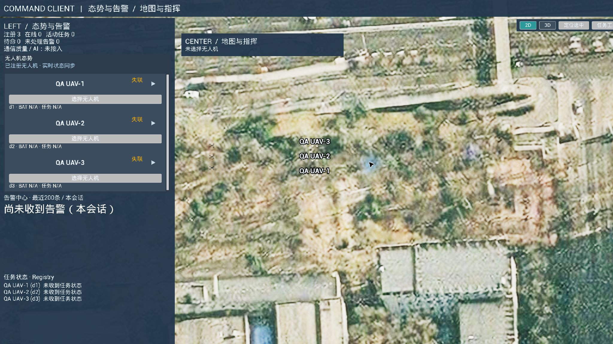
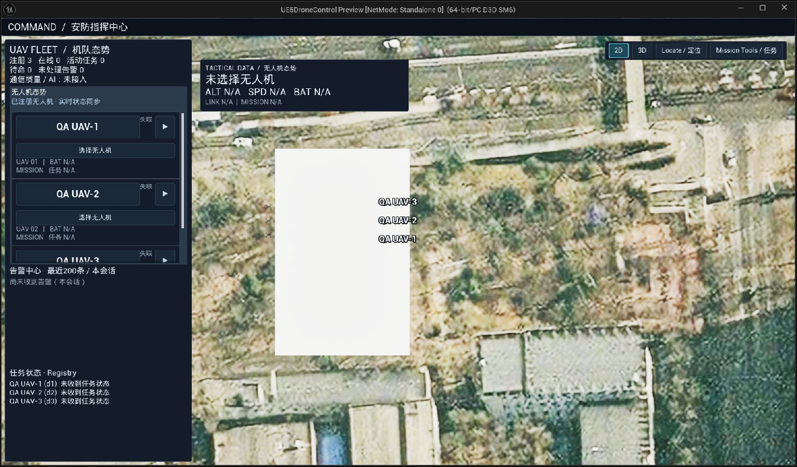

# TASK-A3 physical evidence

These are actual Unreal Editor / PIE window captures, not design mockups. QA UAVs are cached local test descriptors; telemetry shows LOST / N/A because no real Backend was running. Alert cards explicitly say `QA visual state` and were injected through the existing AlertStore delegate.

The final PIE viewport was configured at 1920×1080. Computer Use captures the surrounding window at the current Windows scale (1542×904 capture); the earlier Before capture uses a different editor window layout. Compare visual treatment and layout, not pixel-identical camera framing. Files retain the original JPEG capture bytes.

## Before / After

Before:

After:

## Actual states

- [Selected UAV](02-selected.jpg)
- [Path planning](03-path-planning.jpg)
- [Confirm](04-confirm.jpg)
- [Local Playback](04-playback.jpg)
- [Mission tools](05-mission-tools.jpg)
- [Geographic](06-geographic.jpg)
- [Sequence](07-sequence.jpg)
- [3D mode](08-3d.jpg)
- [QA CRITICAL / WARNING alerts](09-alert-critical-warning.jpg)
- [QA INFO alert](09-alert-info.jpg)
- [Speed](10-speed.jpg)
- [Return to 2D with selection and Playback retained](11-2d-roundtrip.jpg)

Local white map regions and low-height 3D occlusion are visible limitations, not edited out of captures. See the acceptance report for the evidence boundary and full final results.

The playback route displays the existing conflict-priority red. This capture does not claim an isolated, conflict-free green Active state, nor a Completed-state visual check. The planning capture verifies the new amber material and numbered physical waypoints.
