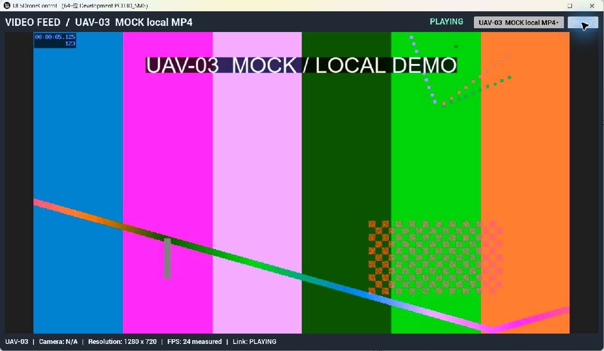

# TASK-V1 physical evidence

实际 UE 5.8 原生 OS 窗口与 PIE 截图。Video source 是生成的带编号 Mock MP4，经现有 MediaMTX WebRTC 页面播放；不是 UAV 实景。Video captures 保留工具返回的原始 JPEG 字节，1282×746 为 Windows 缩放后的窗口 capture；Command 截图为真实 PIE viewport（1920×1082，保留已知高度问题）。

- [UAV-01 播放](01-uav01.jpg)
- [UAV Selector 可操作、三选项清晰](02-selector.jpg)
- [UAV-02 播放](03-uav02.jpg)
- [UAV-03 播放](04-uav03.jpg)
- [UAV-03 Retry 后恢复](05-retry.jpg)
- [Command 回归，保留白色地图区域](06-command-regression.png)
- [最终自动化逐项结果](automation-final.json)
- [MP4 source/hash](demo-sources.json)
- [稳定会话数 1，退出后 0](webrtc-sessions.json)
- [源切换和 peer 释放](media-lifecycle.txt)
- [Video Startup/Source/Shutdown](startup-lifecycle.txt)

单个静态截图不独立证明视频持续播放；播放结论结合肉眼观察帧号/动态图案、媒体元素的解码帧计数、UI measured FPS，以及 MediaMTX 的 H264 read session 和累计 bytesSent。
