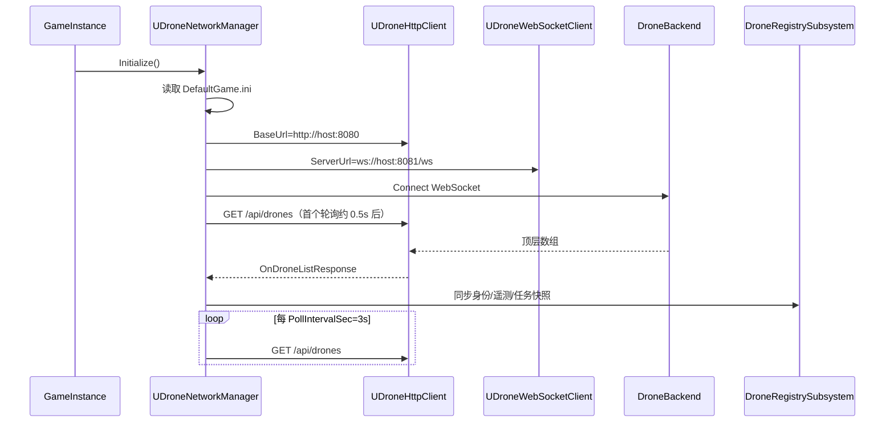
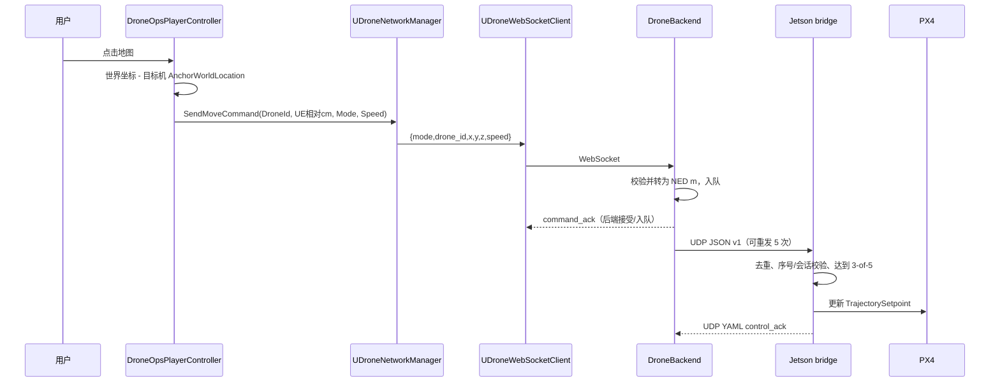
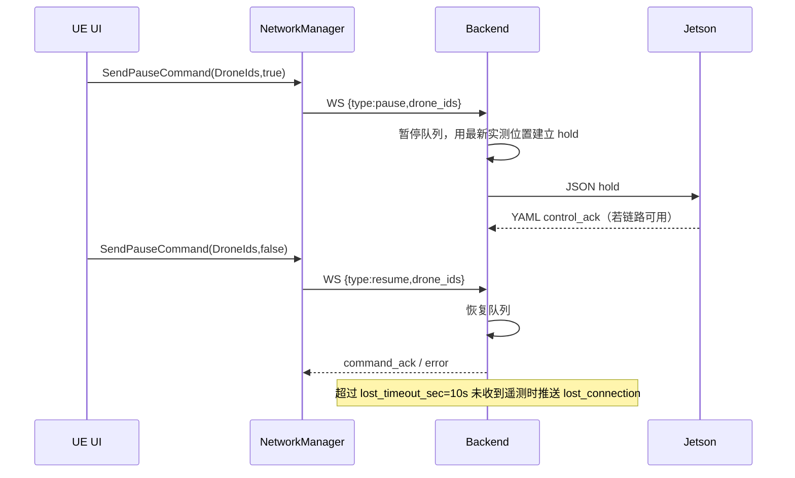
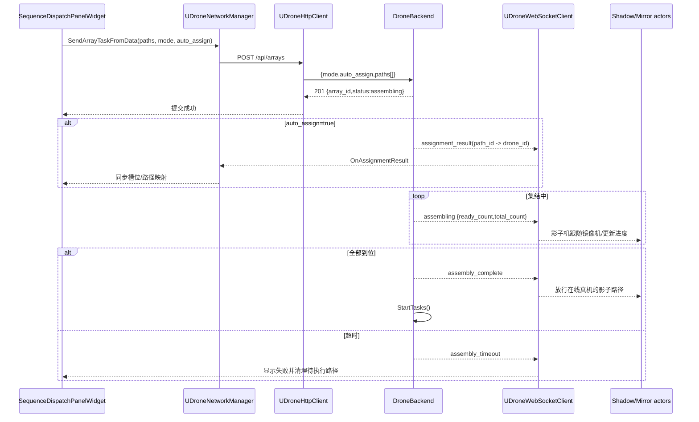
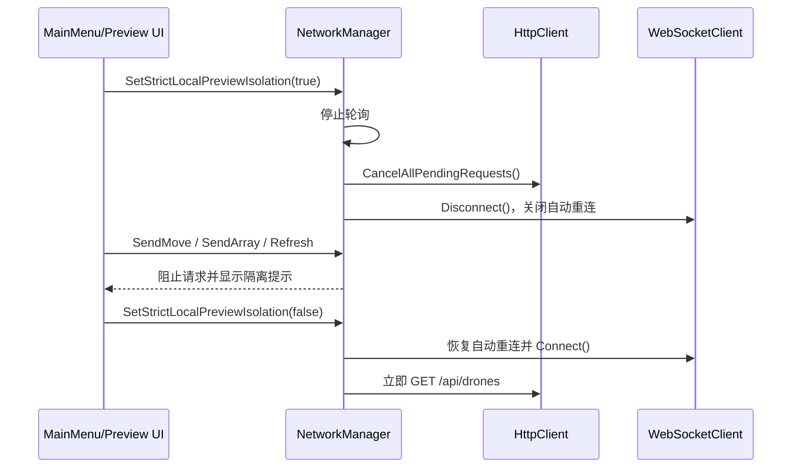
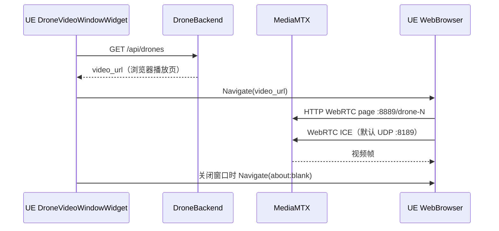
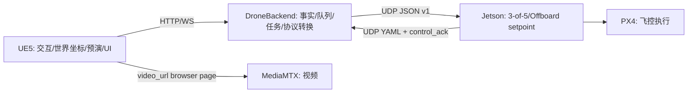

# UE5DroneControl — 当前系统时序图

> 更新时间：2026-09-09
> 图示以当前 `UDroneNetworkManager`、`Backend/http/http_server.cpp` 和 JSON v1/YAML 协议为准。图中“发送成功”不等同于飞控执行成功；执行证据是回传的 `control_ack`。

## 1. 网络管理器初始化



## 2. 单机目标点控制



## 3. 遥测和锚点回传

```mermaid
sequenceDiagram
    participant PX4 as PX4
    participant J as Jetson bridge
    participant BE as DroneBackend
    participant WS as UDroneWebSocketClient
    participant NM as UDroneNetworkManager
    participant REG as DroneRegistrySubsystem
    participant Actor as Mirror actor

    PX4->>J: local position / attitude / battery
    J->>BE: UDP YAML
    BE->>BE: 解析 local_position、GPS、ACK
    alt 首个有效 GPS 遥测
        BE->>BE: 保存 power_on anchor
        BE-->>WS: event power_on + gps_lat/lon/alt
    end
    BE-->>WS: telemetry（UE 相对 cm、姿态、电量、GPS）
    WS-->>NM: OnMessage
    NM->>REG: 更新 telemetry cache
    REG-->>Actor: OnTelemetryUpdated
    Actor->>Actor: 锚点 + 相对偏移，插值更新世界位置
```

## 4. 暂停、恢复和失联



## 5. 阵列任务、自动分配和集结



## 6. 严格本地预演隔离



## 7. 视频窗口链路



## 8. 总体边界


