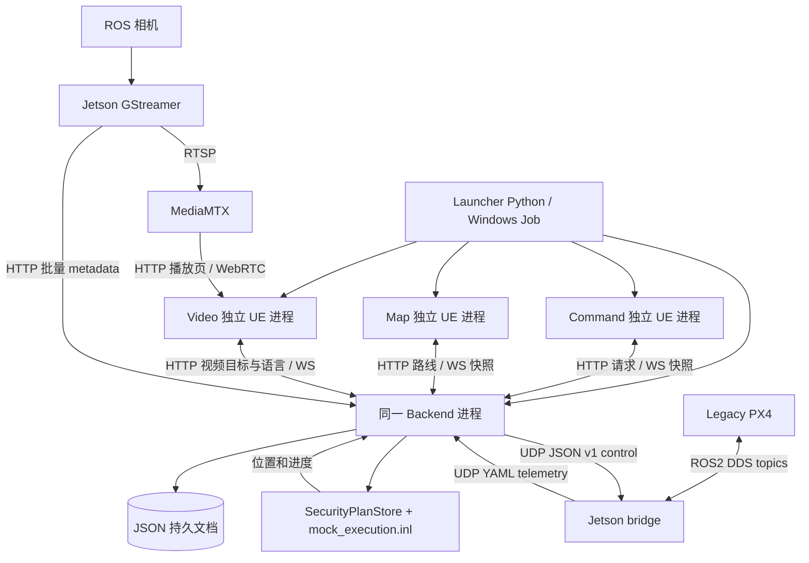
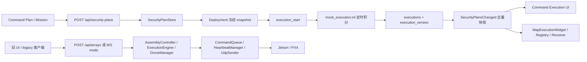
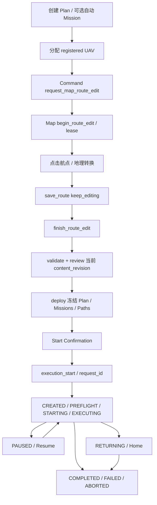
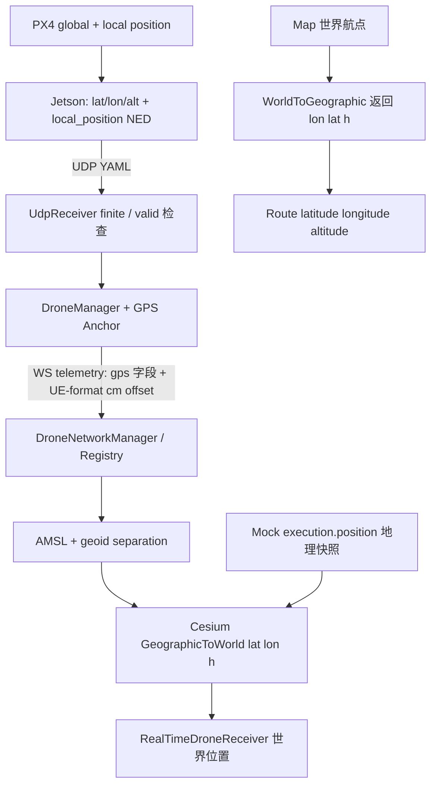

# Stage 1 架构、坐标与数据流

2026-09-20 源码审计。图中的 Legacy 是保留路径，本轮未运行。实线表示代码调用/数据流，不表示本轮通过真机验收。完整功能等级见 [功能审计](Stage1-Feature-Audit.md)。

## 1. 实际架构

媒体像素不经过业务 Backend；Backend 保管 UAV 的 video_url 和独立 video_target_uav_id。Stage 1 Launcher 默认不启动 Jetson、MediaMTX 或真实飞控，不自动建立真机链路。当前四个 Saved Mock UAV 的 video_url 为空。

Authority 分工：Backend 持有共享业务真值和 ACK；Command 负责方案/部署/执行操作；Map 负责地理编辑与显示；Video 负责显式选择播放目标。各 UE 实例都有自己的 Registry 和网络副本，不存在客户端之间的内存共享。Launcher 只持有启动身份/窗口/进程 handle。

## 2. Mock 与真实执行分离

当前没有一个已交付的统一 Execution Adapter 在 Mock/Real 之间切换。不能把示意性的双分支抽象写成代码已经具备。Stage 2 需建立 Plan/Deployment/Execution 与旧真机命令、反馈、失败、幂等/控制版本之间的映射。

Mock 目标 10 Hz（HttpServer 100 ms tick），积分 dt 最大 1 秒，不补算 Backend 停机时间。位置来自 Backend，不由 Map 自行飞行积分。Map Mock 路径隐藏旧影子预演并停其独立 tick，避免双重移动。既有 E18 样本约 9.18 Hz，不应宣传严格实时 10 Hz。

## 3. 业务闭环

配置检查只检查任务、分配、航点有效性、编辑会话与修订；不是飞行前安全签收。Start 要有已部署快照、可用 Mock UAV、无活跃执行冲突、在线 Map。执行改变 execution_version，不改变 Plan content_revision。状态机的可用控制以 Backend 拒绝/ACK 为准。

## 4. 坐标接口总表（12 项，按具名转换方法计数）

| ID | 函数/位置 | 输入 → 输出 | 单位/原点 | 状态 |
|---|---|---|---|---|
| G01 | UCesiumCoordinateService::GeographicToWorld | 参数 Latitude,Longitude,Altitude → UE FVector | 度/椭球高 m → 世界 cm；CesiumGeoreference | 当前使用 |
| G02 | UCesiumCoordinateService::WorldToGeographic | UE FVector → FVector(Longitude,Latitude,Height) | cm → 度/椭球高 m | 当前使用，注意返回顺序 |
| G03 | Backend CoordinateConverter::NedToUeOffset | N,E,D → X,Y,Z | m→cm；X=100N,Y=100E,Z=-100D | 真机保留 |
| G04 | Backend CoordinateConverter::UeOffsetToNed | X,Y,Z → N,E,D | cm→m；N=.01X,E=.01Y,D=-.01Z | 真机保留 |
| G05 | USimpleCoordinateService::NedToWorld_Implementation | NED → UE-format FVector | 纯线性 cm 换算；函数本身不加 anchor；需轴对齐 | 旧基类服务 |
| G06 | USimpleCoordinateService::WorldToNed_Implementation | UE-format FVector → NED | 纯反向线性换算；原点补偿由调用方处理 | 旧基类服务 |
| G07 | UDroneNetworkManager::ConvertMslToWgs84EllipsoidHeight | H_AMSL → h_ellipsoid | h=H+GeoidSeparationMeters，m | 真机地理显示 |
| G08 | FGeographicDispatchOffsetCalculator::CalculateBackendRelativeOffset | target/current WGS84 AMSL + 当前 local offset + 附加 offset → absolute PX4-local UE-format offset | WGS84 曲率半径局部近似；cm；非 Cesium 世界轴 | 保留地理派发 |
| G09 | DroneOpsGameMode.cpp::Wgs84ToGcj02 | lon,lat → GCJ lon,lat | 度；中国范围外不偏移 | 栅格定位 |
| G10 | DroneOpsGameMode.cpp::Gcj02ToWgs84 | GCJ lon,lat → WGS84 lon,lat | 3 次迭代逆解；度 | 栅格定位 |
| G11 | ue_px4_msgs/utils.py::GPSConverter.gps_to_enu | lat,lon,alt + reference → E,N,U | 局部近似 m；参考 GPS 原点 | Legacy，未见当前主线调用 |
| G12 | ue_px4_msgs/utils.py::GPSConverter.enu_to_ned | E,N,U → N,E,-U | m | Legacy |

重复的 Python UE↔NED wrapper、WebMercator 瓦片计算、姿态四元数转换不再计入这 12 个主要地理/位置接口，但均存在：`ue_px4_msgs/utils.py::CoordinateConverter`、`CommandTacticalMap::Project`、`DroneOpsGameMode.cpp::WebMercatorTile*`、`Backend/conversion/quaternion_utils.cpp`。

CRS 证据：`GeographicTypes.h` 明确 WGS84，地理派发计算采用 a=6378137、f=1/298.257223563；Cesium 服务调用 LLH API。没有找到本工程自有显式 ECEF 接口；Cesium 内部 ECEF 细节 **UNKNOWN — requires original integration documentation** 或插件源码专项检查。没有找到 BD-09 实现。GCJ-02 是栅格补偿实现，不能用它改写真机 GPS payload。

`USimpleCoordinateService` 的 GeographicToWorld/WorldToGeographic 返回零且 IsGeographicSupported=false，不能把 fallback 当成可用 GPS 转换。Cesium 缺 Georeference 也返回零并报告不就绪；消费者必须看 ready/support，而非把零当有效地理结果。

## 5. 高度、原点与误差边界

真机 gps_alt 的 Backend/文档语义为 AMSL 米，Jetson 实际读取 `VehicleGlobalPosition.alt`；接回时必须核实部署 px4_msgs 定义，不能仅依赖文件头旧字段描述。UE 地理显示显式加 `GeoidSeparationMeters`，当前默认 0，并未证明等于现场大地水准面差。

Map 保存 route 时逆变换直接存 `G.Z` 到 altitude，因此 Stage 1 路线 altitude 是 Cesium LLH 椭球高。Mock Home 同样直接给地理显示，配置没有独立 CRS/高度基准字段；其物理地面合理性尚未验证。不能把 Mock 30 m Home 当成真机 30 m AGL，也不能把 route altitude 不经处理发送为 PX4 NED Down。

Georeference 来自运行世界的 ACesiumGeoreference；GameMode/主菜单可设置原点，旧 `Saved/Settings.txt` 保存 BackendAddress|Lat|Lon|Alt|bUseCesium。关卡二进制默认原点未在本轮导出；样本中的世界坐标不可脱离当时原点重用。NED 原点是 PX4 本次 local/power_on origin，不是整个 Cesium 世界原点；Backend/GPS anchor 与 local_position 分开。

经纬度有效范围、finite 检查、local_position_valid、GPS/local 时间差检查、反经线最短差和有限目标检查均存在。GCJ 逆解固定三次，旧 ENU 近似、Mock 球面局部距离均不是测绘精度承诺。GPS 误差协方差/RTK 质量等未发现进入 Stage 1 通用 schema。已有 1082 vs 1080 截图/窗口差异和低高度遮挡仍是视觉证据边界，不靠抬高坐标掩盖。

## 6. 共享与刻意隔离

| 状态 | Owner/同步 | 持久化 |
|---|---|---|
| active_uav_id/active_alert_id/active_mission_id/active_security_plan_id/active_area_id/operation_mode | OperationalContext，Backend→三端 | operational_context.json |
| video_target_uav_id | VideoView 独立域；明确 View Video/选 feed 才修改 | video_view.json（有更新才落盘） |
| language | Shared Preference；en/zh-Hans；UE 改 culture | ui_preferences.json |
| Deployment/Execution | SecurityPlanStore 域；不是 Context 字段 | security_plans.json |
| 编辑 lease/owner/dirty | Backend edit_sessions + Map 本地未保存 draft | session 随业务文档，未保存点不等于已落盘 |
| Alert 已处理/删除、本地 Log 清理界线 | Command 会话内状态 | 不删除 Backend events |
| Camera/zoom/pan、Video 布局、窗口 Focus、当前 Widget 页/输入 | 各客户端 UI | 不作为共享业务真值；workflow_step 另有业务记录 |

HTTP 注册 → context 初始快照 → WS subscribe_context → 订阅确认及当前 context → Plan/Preferences/Video 全量补齐 → hydrated heartbeat。Context 只接收更高 context_version，Plan 与 Execution 分别比较版本；远端更新应用到 UI 时防止反馈循环。心跳约 3 秒；服务端超过 12 秒令客户端离线。所有这些是单机状态同步，不是已认证跨网部署。

## 7. 持久化与配置

Backend 持久数据按 7 个文档/记录族统计，UE 另有 2 个 legacy 本地数据族。路径相对实际工作目录；Launcher 与直接运行 Backend 的数据目录不同。

| 文件/族 | 内容/Owner | 初始化与覆盖 | restart / shutdown |
|---|---|---|---|
| drones.json | 身份、slot、IP/port、video_url / Backend | Launcher 仅不存在时 seed 四个 Mock | LoadDrones 恢复描述符；实时 telemetry 不持久 |
| operational_context.json | 当前共享选择、version / Backend | 默认空 ID，更新落盘 | 恢复当前选择 |
| security_plans.json | Plan/Mission/Route/Deployment/Execution/Event/edit_sessions/request IDs / Backend | 首次空集合；事务原子替换 | ACK 后保留；单独重启执行从样本续算 |
| ui_preferences.json | language/version / Backend | 默认 en；当前 Saved 为 zh-Hans | 同步恢复 |
| video_view.json | video target/version / Backend | 默认 null；无更改不一定有文件 | 当前 Saved 缺失为正常默认空态，不等于损坏 |
| mock_execution.json | default_speed_mps、uavs/Home / 配置 Owner | Launcher 仅缺失时复制 Backend fixture | 不覆盖已有配置；运行加载为 mock_execution |
| metadata/drone-*/mission/batches/*.jsonl + session/completed.json | 相机逐帧 metadata / Backend | Jetson batch_sequence 幂等 | 非 Stage 1 业务执行记录；当前未验证生产采集 |
| Saved/DronePaths/*.json（额外） | 旧路径/编队 / UE | 手动保存，文件名清洗 | 不同于 Backend 已部署路线 |
| Saved/Settings.txt（额外） | 旧主菜单 Backend/地理原点 / UE | 4/5 段兼容 | 不等于 Launcher/config.json |

未发现 Stage 1 业务使用数据库或 SaveGame 存储；SaveGame 的 include/注释不构成实际写入证据。Cesium SQLite/cache 属图层缓存，不是 Plan 数据库。Launcher 日志/PID/session 文件在 Saved/Stage1，仅用于进程管理和证据。

| 配置 | 关键内容 |
|---|---|
| Launcher/config.json | Backend/build-p52/Release/DroneBackend.exe；UE5.8 Editor；CesiumWorld；19780/19781；Saved/Stage1；20 FPS cap；180 秒启动 timeout |
| Launcher/runtime.py 生成 Saved/Stage1/backend.yaml | debug false、port_map 空、data/drones.json、metadata；Mock 地址 loopback 29999；不取现场 port_map |
| Backend/config.yaml | 直接运行默认 HTTP 8080、WS 8081、debug true；port_map、jetson.host、5 Hz heartbeat、5 次重发、10 秒 lost timeout、storage/log |
| Backend/mock_execution.json | 四个 Mock UAV；8 m/s 默认；Home 不等于 WP1 |
| Config/DefaultGame.ini | DefaultClientRole=Command、OperationalContext、GeoidSeparationMeters=0 |
| Config/DefaultEngine.ini / DroneMapSettingsBlueprintLibrary | tiles/raster URLs、GCJ/WGS 选择、图层/离线平面参数；地址/凭据不对外复制 |
| UE 命令行 | ClientRole、P5Instance、P1Http、P1Ws、windowed/ResX/ResY、ExecCmds=t.MaxFPS；完整参数见 runtime.py::role_arguments；地图默认由 CommandMap.DefaultMapMode 读取。A2MapMode 是自动化测试名，不是当前地图模式命令行参数 |
| Jetson env / CLI | BACKEND_HOST、CONTROL_PORT、TELEMETRY_PORT、ROS_TOPIC_PREFIX、PX4 system ID、视频 host/port/topics；见真机专项 |

统一 Shutdown 先提示活动执行，允许取消；确认并成功持久化暂停后才停 owned 进程。重开保持 PAUSED，需显式 Resume。单独重启 Backend 则按持久状态继续；客户端重启只重新 hydrate。Launcher 不删除数据，不终止其未拥有的兼容 Backend。本轮没有执行上述操作。
